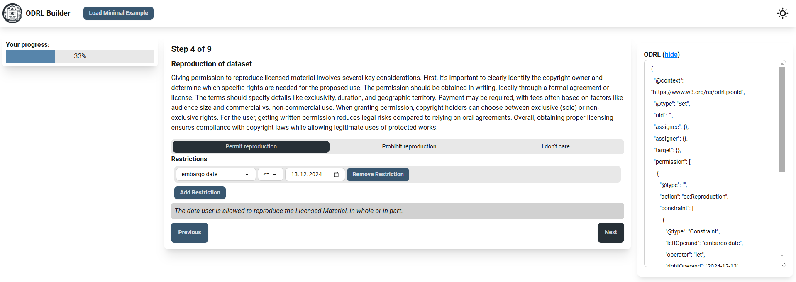
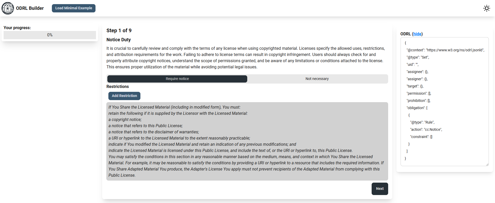
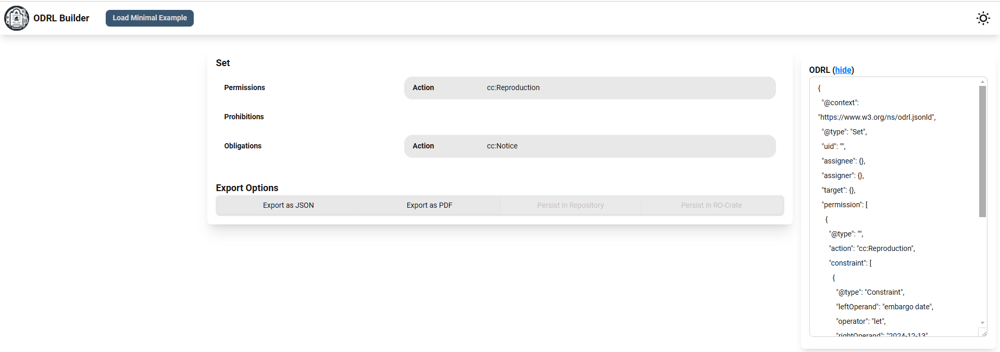

# Introduction

Data use agreements (DUAs) play a crucial role in facilitating access to digital resources while ensuring proper data governance and protection. However, the creation and management of DUAs often present challenges, particularly for legal laymen who lack expertise in legal drafting. Recent developments in data governance, such as the Data Governance Act (DGA), underscore the need for more efficient and standardized approaches to DUA creation and management.

<!-- TODO: Intro to ODRL  -->

The objective of our project is to address these challenges by developing a web application for creating DUAs that adhere to the ODRL standard. This application will enable users to create DUAs step-by-step through a configurable graphical user interface, leveraging the ODRL data model in the background. By doing so, we seek to empower legal non-experts to create DUAs with minimal effort while maintaining the complexity and precision required for legal compliance. The proposed system will not only simplify the DUA creation process but also enable the validation and rendering. Furthermore, we explore the integration of ODRLs in various formats, such as ARC-RO-Crate.

By addressing these challenges, our project contributes to efforts towards harmonizing technical solutions for DUA management, aligning with initiatives like the European Open Science Cloud (EOSC) that recognize ODRL as a core metadata schema for legal interoperability. This approach holds the potential to enhance trust among data owners, particularly for sensitive datasets, thereby facilitating access to valuable resources while ensuring proper data protection. The project contributes to various national and international initiatives focused on data sharing, biodiversity research, and agricultural data management. By developing this innovative solution, we aim to improve the accessibility of resources, ensure efficient and secure sharing, and support ongoing efforts in data-driven research across disciplines.

# Results
During the event, we developed a first version of a web service to generate, validate and render data use agreements (DUAs) using the Open Digital Rights Language (ODRL). Since the main features of the service can be easily separated, we decided to split the application logic into a serverless frontend for the generation and a RESTful API controlled backend server to validate and render the resulting DUAs. This comes with the added benefit, that either part can be maintained and used without requiring the other part, increasing the flexibility and reusability of our service. We deployed both parts on the de.NBI Cloud and made them publically available through https://odrl.gi.denbi.de and https://odrl.gi.denbi.de/api respectively. Finally, integration of these services into ARC-related workflows was discussed and party prototyped.

## "Building Blocks"

We derived multiple building blocks for the ODRL representation and rendering the DUA based on the Creative Commons Licenses, as those are mainly used in research data management.

| Action             | Type                   | Description |
|--------------------|------------------------|-------------|
| cc:Reproduction    | Permission/Prohibition | The user is (not) allowed to reproduce the work for their own use            |
| cc:Distribution    | Permission/Prohibition | The user is (not) allowed to distribute the work for the use by other users            |
| cc:DerivativeWorks | Permission/Prohibition | The user may base derivative works on the work            |
| cc:attribution     | Permission/Prohibition | The user has to attribute the creator of the work            |
| cc:CommercialUse   | Permission/Prohibition | The work may (not) be used for commercial purposes such as selling it             |
| cc:ShareAlike      | Duty                   | The work has to be shared under the same conditions like the ones the user received it with             |
| tdm:mine           | Permission/Prohibition | Text and data-mining is (not) allowed for this work[^1]            |
| cc:Notice          | Duty                   | Copyright and License of the work must be kept intact            |

## Web application

The web application uses the foundation of the ISA Wizard [@citesAsRecommendedReading:arend_biohackrxiv_nodate]. This includes the generation of entities from JSON schemas, which were manually created for this project, the formal logic of building a JSON using a two-way binding between the graphical user interface (GUI) and the stored ODRL as well as the general layout of the GUI. 
Instead of going along the JSON structure, we decided that it is more intuitive in the ODRL use case, to structure the questionnaire based on what the user wants to allow/disallow or respectively require. 
Therefore, the main objective was the implementation of two reusable components that can be utilized for actions that either permit or prohibit certain kinds of data access (cf. Building Block type "Permission/Prohibition") or for actions that require their execution to get access to the data (cf. Building Block type "Duty").

**Figure1:** Reusable component to switch between permitting or prohibiting a certain action. In this example, the user can permit or prohibit the reproduction of their dataset. They decide to allow reproduction with the constraint, that it has an embargo until the 13th of December 2024.

**Figure 2:** Reusable component to require a certain action to grant the permission on the dataset. In this example, the user requires to notice the terms of use and licenses for the dataset. 

Both components, as depicted in Figure 1 and Figure 2, are designed and implemented in a similar way. Below the heading a short description of the action is provided to explain the user, what they are currently deciding on. Then a button bar is provided allowing the user to select their choice. The application will create and remove the rule accordingly so that at all times the GUI is reflecting the ODRL and vice versa. If appropriate, the user can add additional restrictions to the action. Below the restrictions the user sees a preview of the text or the consequences (in the case of not requiring or selecting an action) of their selections.

When the questionnaire is finished, the user is redirected to the overview page (cf. Figure3). From here they see the selected rules and can choose to export the DUA as a ODRL JSON or rendered as a PDF using the backend server.

**Figure3:** Overview page of the generated GUI. The button bar at the bottom allows the user to export the ODRL as a JSON file or rendered as a PDF. The persistance options will be implemented in a later stage.

## Backend Server

The backend server, implemented in Rust, is responsible for processing ODRL JSON-LD documents and generating PDF files from the resulting rules. It employs a RESTful API to provide the web application with an interface that facilitates the validation of data access rules and their exportation in various formats.

The server plays a pivotal role in the management and processing of ODRL JSON-LD documents. It receives these documents via a RESTful API and validates them using a predetermined schema based on the ODRL Information Model 2.2. The rules contained within are then analysed and processed internally to enable conversion into other formats. Incorrect or incomplete JSON documents are recognised and provided with corresponding error messages to help users correct them.

An essential part of the backend functionality is the conversion of ODRL models into PDF documents using the Typst format. This process begins with the creation of a Typst template from the ODRL JSON-LD, which is then converted into a PDF document. The resulting PDF provides a clearly structured representation of the data access rules and contains all permitted, prohibited and required actions.

The backend server also serves as a communication interface for the web application, which can send JSON-LD documents to the server in order to validate or export them. The server provides endpoints for this in order to analyse the ODRL JSON-LD and offer the generated PDF files for download. The integration of persistence mechanisms is planned for the future in order to facilitate the long-term saving and management of the created rules.

## Integration into ARC

Integration of ODRL into the [Annotated Research Context](https://arc-rdm.org/) (ARC) [@citesAsAuthority:Weil.2023] was thoroughly discussed and partly prototyped. The ARC is an abstract data model specification for a FAIR Digital Object, encompassing the whole research cycle from creation of the observed samples to computation of the results. 

We discussed integration of ODRL in both equivalent, concrete representations of the ARC: In the [ARC-RO-Crate-Profile](https://github.com/nfdi4plants/arc-ro-crate-profile/issues/19), the ODRL JSON-LD could directly be placed into the Root Data Entity. Similarly, in the more user-facing [ARC-Scaffold-Specification](https://github.com/nfdi4plants/ARC-specification/issues/133), the ODRL could be placed in a `TermsOfUse.json` in the root folder. 

Creation and manipulation of this ODRL file requires tool support, which has been prepared in form of the ODRL Wizard. An integration of this ODRL Wizard in [ARCitect](https://github.com/nfdi4plants/ARCitect/issues/314) could provide a solid one-in-all solution for Researchers working with the ARC Scaffold.

To satisfy the requirements of validation and human readability of this ODRL file, a validation package was added to the [ARC Validation Package Registry](https://avpr.nfdi4plants.org/package/odrl) (AVPR), which is a central concept in the git-based ARC ecosystem. For each ARC several validation packages can be specified and automatically executed on the hosted DataHUB whenever changes are pushed. The package created at this Hackathon acts as a lightweight wrapper for the developed ODRL validation services described in the previous section. In the initial validation, the ODRL gets sent to the service and if the validation succeeds, the user has the opportunity to see the ruleset, created by the ODRL rendering service.

# Discussion

## Alternative Approaches to generating the DUA

In the current version of the tool the DUA is assembled from different building blocks, which may be based on existing licences, but are sometimes reworded with the intention to have the same meaning. However, different wording can lead to a different understanding. Thus it is desirable to use existing and well established license terms whenever possible. A way to do this is to match the selected ODRL representations of the selected terms to the ODRL mappings of established licenses, as e.g. collected here: (https://rdflicense.linkeddata.es/index.html). If there is a match, the user should be prompted whether he wants to use the preexisting license instead of the custom one. This would then be used for rendering the DUA in a human readable way.

Yet another approach to the one discussed here would be to let the user select from a set of standard licenses and use the ODRL mappings of those. But this approach would loose the flexibility of custom licenses and would limit the user to established types. This limitation would hinder the user from quickly adapting their licenses to a changing legal environment, e.g. when the Regulation (EU) 2023/2854 enters into force.

## Legal Limitations

Mapping legal texts to machine-interpretable representations has its very own limitations. Two main limitations are the handling of divergences of the human-readable and the machine-readable version of the text and flexibility in the face of new situations. If human-readable and machine-readable versions claim the same validity, the common meaning must be determined in the event of differences. This problem is similar to the interpretation of the wording of multilingual legal acts by the CJEU.[@citesAsAuthority:EuGH.1996;@citesAsAuthority:EuGH.1982]

This problem can be circumvented by defining a priority rule, for example in the general terms and conditions of a platform. As machine-readable or -interpretable approaches need reliability of the transmitted (legal) information, it is advised to give priority to the machine-readable terms.

Machine actionable terms allow only for very limited flexibility, especially in new situations.[@citesForInformation:Effer-Uhe.2023; @citesForInformation:Anzinger.2023 Rn. 12]
In the field of licensing flexibility in the interpretation of contractual terms is less of a concern, as transactions usally happen en masse and are meant to be similiar. Also, the contractual terms usual do not "react" to a specific situation, but shape it; the licensees act accordingly to the terms. In such situations, like in the german tax law with ELSTER [@citesForInformation:Mellinghoff.2019, 305], such solutions can shine. Thus the inflexibility of such approaches is less of a concern here.

Furthermore, the effect of the tdm:mine building block remains unclear. Background for the field, at least in german law, is § 44b UrhG, which allows text and data-mining, unless the right holder dissallows such uses of their works. The opt out is required to be machine readable by § 44b (3)(1) UrhG. How this machine readable output should be done is a topic of discussion in german legal scholarship. Besides the tdm:mine [@citesAsAuthority:Maamar.2023, 484] there are others standards suggested like the robots.txt, an ai.txt, the Terms & Conditions, or different kinds of metadata.[@citesAsRecommendedReading:Hamann.2024a, 144-165]. But at least it is clear that additional versions of the opt out do not harm, as long as the "right" one is also used. Yet one has to hope that in the end just one standard is used. Possibly the AI Office, which is established by the AI Act of the EU[^2], will propose such standard, which will prevail due to the attached authority of the office.[@citesAsRecommendedReading:Hamann.2024a, 166]

## Conclusion

In conclusion, the hackathon has provided a valuable platform for exploring innovative approaches to automating data use agreements. We identified several key areas for future work that will enhance our initiatives and address critical challenges in this field.

Firstly, the inclusion of Trade Secrets in our frameworks is essential for ensuring the protection of sensitive information during data sharing. Additionally, harmonizing clauses for PDF generation will promote consistency and clarity in documentation, making it easier for stakeholders to navigate agreements.

We also recognize the importance of validating ODRL statements to avoid impossible licensing combinations, which is crucial for minimizing legal risks. Extending ODRL to better serve small and medium enterprises, in line with practical needs defined by European law, will further support the growth and adaptability of these businesses.

Moreover, expressing purpose limitations in Data Use Agreements (DUAs) is vital for compliance with regulations such as Article 6 of Regulation (EU) 2023/2854 and Article 5 of the GDPR. This will help ensure that data is used appropriately and ethically.

The need for thorough checks of clauses for compliance with laws regarding General Terms and Conditions cannot be overstated, as this will safeguard against potential legal issues. Lastly, assembling a definition list based on the usage of terms within documents will improve clarity and understanding for all parties involved.

While significant progress has been made during the hackathon, there are still open questions and challenges that we look forward to addressing in future discussions and collaborative efforts. Together, we can continue to refine and enhance the automation of data use agreements, paving the way for more efficient and secure data sharing practices.

## Acknowledgements

This work was performed during the de.NBI BioHackathon Germany 2024 organized by ELIXIR Germany in December 2024. This work was funded by ELIXIR, the research infrastructure for life-science data; by the Federal Government of Germany and the county of North Rhine-Westphalia (de.NBI - the German Network for Bioinformatics Infrastructure); by the DFG in frame of the FAIRagro (www.fairagro.net, project number 501899475), NFDI4BioDiversity (www.nfdi4biodiversity.org, project number 442032008) and DataPLANT (https://www.nfdi4plants.de/, project number 442077441); consortia of the NFDI.

## References

- https://w3c.github.io/tdm-reservation-protocol/spec/
- https://www.w3.org/TR/odrl-model/
- https://www.w3.org/TR/odrl-vocab/
- https://www.w3.org/2012/09/odrl/archive/odrl.net/Profiles/CC/SPEC.html
- https://eur-lex.europa.eu/legal-content/EN/TXT/?uri=CELEX%3A32023R2854

[^1]: This field is an extension of the ODRL standard by a community working group and is not normative, https://w3c.github.io/tdm-reservation-protocol/spec/
[^2]: Regulation (EU) 2024/1689 of the European Parliament and of the Council of 13 June 2024 laying down harmonised rules on artificial intelligence and amending Regulations (EC) No 300/2008, (EU) No 167/2013, (EU) No 168/2013, (EU) 2018/858, (EU) 2018/1139 and (EU) 2019/2144 and Directives 2014/90/EU, (EU) 2016/797 and (EU) 2020/1828 (Artificial Intelligence Act).

# Bibliography